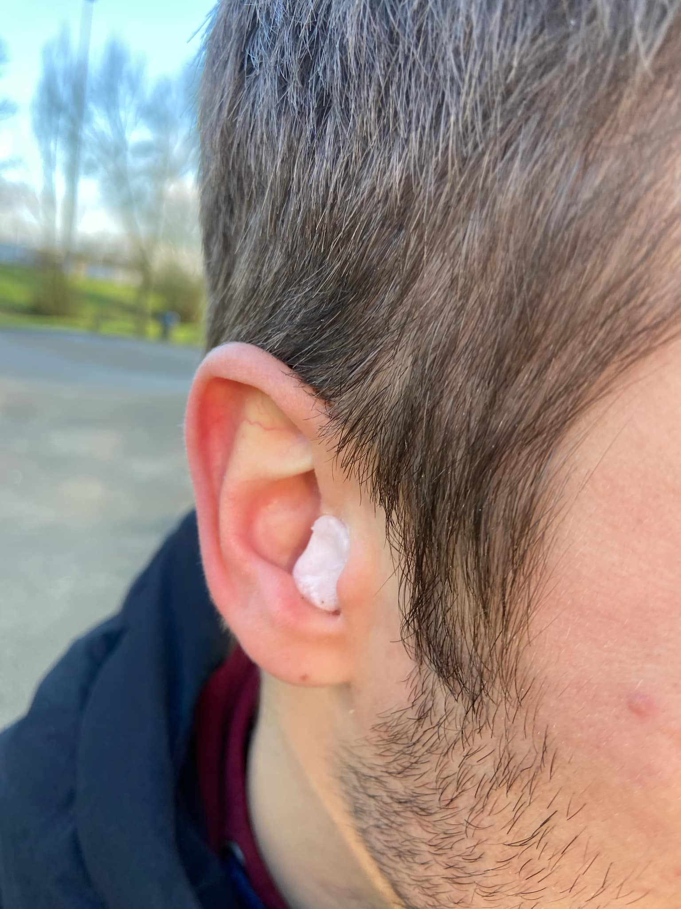

# BRIQ
Hoe kan ik 65-plussers samenkrijgen om aan multisensoriële oefeningen te doen?

*Projectteam: Kasper Stas, Joachim Waeyaert*

Datum 08/01/2022

## Samenvatting
Dementie wordt vaak behandeld in plaats van te voorkomen, terwijl preventie juist essentieel is. Uit wetenschappelijk onderzoek blijkt dat een combinatie van cognitieve en fysieke stimulatie kan bijdragen aan het uitstellen van dementie. Daarnaast toont onderzoek aan dat sociale interactie een positieve invloed heeft op de cognitieve vaardigheden. Wanneer dergelijke onderzoeken zijn uitgevoerd binnen de doelgroep, werd duidelijk dat motivatie een cruciale rol speelt. Regelmatig gebruik blijkt namelijk moeilijk zonder een sterke drijfveer.

Om deze motivatie te stimuleren, werd onderzocht hoe deze geïntegreerd kan worden in producten zoals de Briq. Drie belangrijke motivatiefactoren kwamen naar voren. Ten eerste is het belangrijk om aan te sluiten bij de interesses en hobby’s van mensen. Ten tweede speelt sociaal contact een grote rol, aangezien veel ouderen dit als een zeer belangrijk aspect ervaren. Tot slot is gebruiksvriendelijkheid van belang; het product moet niet te innovatief of ingewikkeld zijn, omdat dit voor oudere gebruikers een barrière kan vormen.

Door deze drie aspecten te combineren met een multisensorische aanpak, kan dementie bij gezonde 65-plussers mogelijk worden uitgesteld. Dit benadrukt het belang van preventieve maatregelen die zowel stimulerend als toegankelijk zijn voor ouderen.

  

> [!NOTE]
> - Links naar volledige protocollen en reports zijn te vinden onder de [bijlagen](#bijlagen).

## Introductie
Het project ‘Briq’ is ontstaan vanuit het thema ‘Healthy Aging’, waarbij gezocht wordt naar manieren om zowel fysiek als mentaal gezond ouder te worden. Dit thema is geïnspireerd door Ronnie Gardiner, een jazzdrummer die merkte dat drummen niet alleen zijn stemming verbeterde, maar ook zijn motoriek en cognitieve vaardigheden stimuleerde. Deze inzichten leidden tot de ontwikkeling van de Ronnie Gardiner Methode (RGM), een oefenmethode die ritme en muziek gebruikt om meerdere hersengebieden tegelijk te activeren. De methode stimuleert motoriek, spraak en cognitie, en wordt momenteel toegepast in klinische omgevingen, bijvoorbeeld bij revalidatie van neurologische aandoeningen.
Onderzoek[^2] wijst uit dat een combinatie van fysieke en cognitieve uitdagingen elkaar versterkt. In 2023 benadrukte Julien Venesson dit met zijn onderzoek naar myokines – hormonen die vrijkomen door spieractiviteit en bijdragen aan de vorming van nieuwe hersencellen (Venesson, 2023). Dit bevestigt de kracht van beweging in combinatie met mentale stimulatie, zoals toegepast in de RGM-methode.

> "Myokines: het verjongende hormoon dat door onze spieren wordt geproduceerd" (Venesson, 2023)[^2].

De _design challenge_ binnen het project 'Briq' is om een slim product te ontwikkelen dat de RGM-methode op een vernieuwende en toegankelijke manier implementeert. Het doel is om een product te ontwerpen dat niet alleen geschikt is voor klinische toepassingen, maar ook gezonde ouderen stimuleert om mentaal en fysiek actief te blijven. 

> [!IMPORTANT]
> Randvoorwaarden:
> - Het product moet fysieke en digitale componenten bevatten.
> - Het product moet zowel het fysiek als het cognitieve prikkelen.
> - Het product moet zelfstandig kunnen gebruikt worden door ouderen.

Het betrekken van verschillende stakeholders, naast de eindgebruiker, is een cruciaal onderdeel om dit project tot een goed einde te brengen. De belangen van deze stakeholders zijn in kaart gebracht met een _stakeholder map_ en waarbij de twee belangrijkste partijen verder zijn geanalyseerd met behulp van de _Innovatrix_.

  
  

## Methodologie
Om structuur aan te brengen in het ontwerpproces werd er gebruik gemaakt van een duidelijke methodologie, die het eerste semester opdelen in twee grote fasen. De focus lag hierbij altijd op de gebruiker. De opzet van deze methodologie was ontworpen om zo veel mogelijk inzichten te verkrijgen om het ontwerp te verbeteren en verder te ontwikkelen.

  
  
### Discovery
De eerste fase werd gestart door een heldere probleemstelling te formuleren. Dit was noodzakelijk om het probleem goed af te bakenen en gerichte stappen te kunnen zetten. Tijdens deze fase werden benchmarks uitgevoerd om te onderzoeken wat er al op de markt beschikbaar was. Dit gaf een overzicht van de bestaande oplossingen en liet zien waar verbeteringen mogelijk waren. Daarnaast werden er ook user interviews gehouden om de gebruiker beter te begrijpen. Deze gesprekken gaven inzicht in de problemen en uitdagingen die zij ondervonden, wat essentieel was om de problemen goed te kunnen definiëren. Door deze aanpak kreeg het ontwerpproces meteen een gerichte focus, wat cruciaal was voor de volgende fasen.

### Definition
In de daaropvolgende fase werd het concept ontwikkeld op basis van de resultaten uit de Discovery fase. Dit concept was bedoeld om in te spelen op de geïdentificeerde problemen en een oplossing te bieden. Het concept werd vervolgens onderworpen aan verschillende concepttesten om te valideren of het daadwerkelijk effectief was. Deze testen gaven waardevolle feedback die het mogelijk maakte het concept verder te verfijnen en te verbeteren. Door iteratief aanpassingen te maken, werd het ontwerp steeds meer afgestemd op de behoeften van de gebruiker. Het resultaat van deze fase was een lijst van design requirements, die de basis vormde voor de verdere ontwikkeling van het product.

## Discovery
In dit onderdeel wordt onderzocht wat zich binnen de probleemruimte bevindt en of er mogelijke oplossingen voor deze kwesties gevonden kunnen worden. Om inzicht te krijgen in de probleemruimte worden enerzijds interviews afgenomen om te begrijpen hoe mensen het probleem ervaren, en anderzijds wordt gekeken naar bestaande oplossingen op de markt en de hiaten die benut kunnen worden.
### Doestellingen
Een duidelijke ‘how might we’ bekomen

### Materiaal & methoden
-	Benchmarking
-	User interviews
  
### Resultaten
#### User Interviews (N=4)
Tijdens de gebruikersinterviews werden voornamelijk algemene aspecten besprokendie anagestuurd werden door concrete vragen. Wanneer bepaalde vragen bij specifieke respondenten meer relevant bleken, werd daar dieper op ingegaan. Uit de interviews kwam naar voren dat de ene respondent het uitstellen of voorkomen van dementie als een belangrijke motivatie beschouwde, terwijl anderen zich daar minder zorgen over maakten. Voor deze laatste groep werd duidelijk dat hun motivatie vaak voortkwam uit persoonlijke interesses en hobby’s. Wanneer deze interesses aanwezig waren, gaven ze aan gemotiveerd te zijn om deel te nemen aan “Aging Young”. Er werd verder onderzocht welke andere factoren, naast persoonlijke interesses, als belangrijke motiverende elementen zouden kunnen dienen.
Een van de belangrijke factoren die naar voren kwam, is het sociale aspect. Een respondent gaf aan dat veel kennissen van 65 jaar en ouder zich regelmatig eenzaam voelen. Voor hen zou het sociale aspect een sterke motivatie zijn om deel te nemen aan "Aging Young". Onderzoek[^1] ondersteunt dit, aangezien het blijkt dat ouderen die regelmatig in contact staan met vrienden of kennissen beter presteren op cognitieve tests dan degenen die minder sociale interactie ervaren (Bohn, 2021).
Daarnaast werd het belang van de gebruiksvriendelijkheid van de technologie benadrukt. De moderne, vaak complexe digitale wereld wordt door deze doelgroep als frustrerend ervaren. Respondenten gaven aan dat ze behoefte hadden aan producten die herkenbare, nostalgische elementen bevatten – producten die ze kunnen gebruiken of eenvoudig kunnen leren bedienen. De hedendaagse technologie wordt vaak als te ingewikkeld en te vernieuwend ervaren, wat leidt tot frustratie en afkeer bij deze groep.

#### Benchmarks (N=10)
Het doel van het marktonderzoek was om te onderzoeken welke aspecten van het "Aging Young"-concept al aanwezig zijn op de markt en welke van deze aspecten gebruikt of verbetert kunnen worden. Hiervoor werden verschillende bestaande producten of methodes onderzocht en hun voor-en nadelen geanalyseerd. 
Het viel op dat er veel cognitieve en fysieke oefeningen beschikbaar zijn, maar dat de combinatie van beide vaak beperkt is. Een belangrijk kenmerk van "Aging Young" is dat zowel het fysieke gedeelte intensief genoeg moet zijn, als het cognitieve gedeelte prikkelend genoeg. In veel gevallen blijkt het cognitieve gedeelte voldoende prikkeling te bieden, maar blijft het fysieke aspect niet intensief genoeg. Dit kan verklaard worden door de context waarin deze producten of oefenmethoden doorgaans worden toegepast, vaak in zorginstellingen zoals verpleeghuizen. Daar zijn de bewoners vaak niet mobiel genoeg om intensieve fysieke oefeningen uit te voeren of bevinden zij zich al in een gevorderd stadium van dementie. Met de Briq willen we echter juist focussen op mensen die nog in staat zijn om intensieve fysieke activiteiten uit te voeren en die thuis wonen, zonder de hulp van een zorgverlener of instructeur.
Een ander opvallend aspect was dat er vaak geen aandacht wordt besteed aan de motivatie van gebruikers om regelmatig met de producten of oefeningen te blijven werken, vooral wanneer er niemand aanwezig is om hen aan te moedigen of te begeleiden. Om hier meer inzicht in te krijgen, werd er tijdens de interviews (zie ‘user interviews’) verder onderzocht wat de drijvende kracht is achter de motivatie van gebruikers om actief betrokken te blijven bij deze producten.

  
  

  

### Conclusies & implicaties
Een product kan zo ontworpen worden dat het zowel cognitieve als fysieke activiteit bevordert, wat kan bijdragen aan het uitstellen of voorkomen van dementie. Maar zal het product daadwerkelijk gebruikt worden? Uit het onderzoek in de discovery-fase blijkt duidelijk dat, wanneer de interesses van de gebruiker niet worden aangesproken, het gebruik van het product waarschijnlijk beperkt zal zijn, waardoor de effectiviteit ervan vermindert. Om ervoor te zorgen dat het product aanspreekt, is het dus belangrijk om verschillende interesses en motivaties binnen één product te integreren.
Een deel van de 65-plussers is alleenstaand, waardoor het sociale aspect een belangrijke motiverende factor kan zijn. Veel sportieve hobby’s bieden al dit sociale aspect, zoals tennis, badminton en pingpong.
Daarnaast is het algemeen bekend dat frustraties veel zwaarder wegen dan positieve emoties. Om frustraties te verminderen, moet er specifiek gekeken worden naar hoe het product zo gebruiksvriendelijk mogelijk kan worden gemaakt. Dit kan bereikt worden door de interface duidelijk en herkenbaar te maken, het implementeren van tutorials en het gebruik van duidelijke signifiers. 
Op de markt zijn er veel multisensorische producten waarbij de intensiteit van de fysieke activiteit onvoldoende is. Het combineren van een voldoende hoge fysieke intensiteit met cognitieve stimulatie is essentieel om deze gap te vullen.

**Hoe kan ik 65-plussers samenkrijgen om aan multisensoriële oefeningen te doen?**

> [!IMPORTANT]
> Design Requirements:
> - D1.1 Het product dient in een sociale omgeving te kunnen gebruikt worden.
> - D2.1 Het product dient een tutorial te bevatten.
> - D2.2 Er moeten herkenbare kenmerken voor de gebruiker aanwezig zijn in het product.

## Definition

  

In deze fase werd er verder gewerkt op de conclusies uit de discovery fase. Aan de hand van deze inzichten begon de ontwikkeling van de eerste conceptuele prototypes die vervolgens enkele test waves ondervonden.

### Doestellingen
In dit deel van het ontwikkelingsproces de concepten verfijnen. Dit werd gedaan aan de hand van twee _Wizard of Oz_ testen. Dit resulteert in een duidelijke _"How can we"_ om verder mee aan de slag te gaan in het tweede semester.

### Materiaal & methoden
Dit concept werd getest via twee gebruikerstesten, uitgevoerd tijdens tennis- of badmintonspel om een hoge ecologische validiteit te waarborgen. Beide testen volgden de _Wizard of Oz_-methode in combinatie met het _think aloud protocol_ (TAP). Twee onderzoekers voerden de testen uit, waarbij zij de rol van _Wizard_ of observator vervulden. Na afloop werd de verzamelde data geanalyseerd.

De eerste test evalueerde of het concept sterk genoeg was voor verdere ontwikkeling. De _Wizard_ gebruikte gekleurd papier om kleuren weer te geven, terwijl een quiz het vragengedeelte testte. De observator noteerde gedachten en handelingen van de respondenten. Nadien werden aanvullende vragen gesteld.

Na bevestiging van het concept werd een tweede prototype ontwikkeld. Ook dit prototype was primitief vanwege de vroege ontwikkelingsfase. De test onderzocht de plaatsing van kleuren en de luidspreker. De Wizard bediende bij deze test alles op afstand. Een ledstrip toonde kleuren op verschillende posities aan het net. De respondenten speelden badminton en riepen de kleur wanneer deze veranderde. De luidspreker werd op verschillende veldzijden getest door quizvragen te stellen. De observator noteerde opnieuw de gedachten en handelingen van de respondenten.

### Resultaten
#### Wave 1 (N = 4)
Tijdens de eerste testwave werden enkele problemen snel duidelijk. Aanvankelijk stond de Wizard aan het net (figuur links) om vragen te stellen en kleuren met de bijbehorende straf weer te geven. Omdat spelers vaak vroegen de vraag te herhalen, verplaatste de Wizard zich naar de kant van de spelers die de vraag kregen (figuur rechts). Dit verminderde het aantal herhalingsverzoeken aanzienlijk, wat ook werd bevestigd door de respondenten. Zij gaven aan open te staan voor deze aanpak, mits de vragen duidelijk hoorbaar waren.

  
  

Bij het testen van de kleuren ontstonden ook problemen. Respondenten keken niet weg van de bal om de kleur te zien, wat ze toeschreven aan de competitieve aard van het spel. Zelfs bij recreatief spelen vonden zij dat competitie niet mocht belemmerd worden. Daarnaast werd de juiste straf vaak te laat of niet toegepast omdat respondenten de juiste combinaties niet meer wisten. Straffen mochten bovendien niet te hinderend zijn, omdat dit het spelplezier noemenswaardig verminderde. Hoewel de respondenten het idee waardeerden, veroorzaakte het rudimentaire prototype enige frustraties, wat hun enthousiasme mogelijk beïnvloedde.

Bij deze testwave stonden de respondenten open voor het idee, maar er waren ook wel frustraties. Doordat het concept een zeer rudimentair prototype had heeft dit waarschijnlijk ook een invloed op het enthousiasme van de respondenten.

#### Wave 2 (N = 6)
Bij de tweede testwave zegde de oorspronkelijke testgroep af wegens ziekte. Door feestdagen, waardoor de respondenten enkele weken niet tennisten, en aankomende examens werden nieuwe respondenten van 18 en 23 jaar ingeschakeld. Om de validiteit van de test te verhogen droegen zij oordopjes om de hardhorigheid uit wave 1 na te bootsen.

  
  

De tests wezen op een minimaal verschil in hoorbaarheid tussen verschillende luidsprekerposities, dankzij het heldere en krachtige geluid van de box. De voorkeur ging echter naar de frontale positie, mede omdat verbindingsproblemen bij een achterste positie de spelervaring verstoorden. Respondenten raakten gefrustreerd als vragen niet snel genoeg achter elkaar kwamen, wat de voorkeur voor de frontale opstelling versterkte.

Bij het weergeven van kleuren bleek dat dit vaak afleidde van het spel. Toch vonden de respondenten dat een feller verlichte ledstrip, bevestigd bovenaan het net, de kleuren goed zichtbaar maakte zonder de aandacht van het spel af te leiden. Dit voldeed aan de eisen uit wave 1. Ze suggereerden ook dat de kleur geïntegreerd kon worden in een interactief spelonderdeel, zoals het pluimpje of racket, omdat deze altijd de meeste aandacht krijgen tijdens het spel.

### Conclusies & implicaties
Uit deze twee gebruikerstesten zijn er enkele belangrijke elementen voortgekomen om zo het product op te bouwen.
1)	De vragen moeten duidelijker aankomen. Dit kan door ze luider af te spelen of van dichterbij. Om dit te verbeteren zijn er enkele ontwerpstrategieën die toegepast worden. Er kan een box achter beide partijen geplaatst worden, de spelers kunnen een oortje gebruiken of er kan een luidspreker op de raket of arm geplaatst worden.
2)	Voor de kleuren zijn er twee pistes die verkend worden. Enerzijds kan de kleur verduidelijkt worden door aan het net een led strip te hangen. Zo nemen de spelers de ogen niet van de bal en kan de kleur vanuit een ooghoek gevat worden. Anderzijds wordt het kleurenprincipe aangepast door ze te vermelden via de luidspreker in plaats van deze te tonen.
3)	De straffen moeten niet te moeilijk gemaakt worden. Het is belangrijker dat de link wordt gelegd met wat er moet gebeuren in plaats van de moeilijkheidsgraad. 
4)	Volgende prototypes moeten meer ontwikkeld worden om zo de geloofwaardigheid van het concept te verhogen.
5)	De kleur zal zich bevinden bovenop het net en intensief genoeg weergegeven worden. Zo is de kleur ook zichtbaar vanuit een ooghoek en hoeft de volledige aandacht niet afgeweken worden. 
De reden dat er niet voor het pluimpje gekozen wordt is omdat dit universeel ook moet kunnen toegepast worden in tennis en andere netsporten. Ook zal de duurzaamheid voor problemen zorgen. 
6)	De positie van de speakers is het best gepositioneerd onder het net, wijzend naar beide partijen (2 speakers).
7)	Onderling gepraat tussen de partijen over wat het antwoord van de vraag zou moeten zijn zorgt voor onduidelijkheden over wat hun definitief antwoord is. Indien we in de toekomst willen werken met AI recognition zal het moeilijk zijn om hierin te filteren.

> [!IMPORTANT]
> Design Requirements:
> - D2.3 De strafmechanismen mogen geen grote impact hebben op het spel.
> - D2.4 De puntenregistratie moet soepel en foutloos verlopen.
> - D3.1 De spraakmodule moet luid en duidelijk zijn.
> - D3.2 De vragen mogen maximaal één regel lang zijn.
> - D3.3 Tussen de vragen mag er maximaal tien seconden pauze zitten.
> - D4.1 Het vermelden van de kleur moet zowel auditief als visueel duidelijk zijn.
> - D4.2 De kleuraanwijzing moet zich aan de bovenkant van het net bevinden.
> - D4.3 De intensiteit van het licht moet duidelijk zichtbaar zijn in een goed verlichte omgeving.

## Bill of materials
1. Hardware: LED-strips, speakers, microcontroller (arduino), voeding, basis arduino kit
2. Prototype-materiaal: karton, hout, PLA (3d-printen)

## Kritische reflectie
Sinds het samenstellen van de groepen is het project in een constante stroomversnelling terechtgekomen. Dankzij een gezamenlijke, kritische benadering heeft het gekozen concept doorlopend verfijning en verbetering ondergaan. Elk idee werd zorgvuldig geanalyseerd en getest, wat leidde tot een sterke basis voor verdere ontwikkeling. Ondanks onverwachte obstakels, zoals het last-minute afzeggen van de testgroep in een cruciale fase, is er adequaat en snel geschakeld naar een alternatief plan. Dit getuigt van een pragmatische houding en een flexibele werkwijze binnen het team.

Hoewel het alternatief niet direct de beoogde doelgroep betrof, werden de resultaten zorgvuldig en met een kritische blik geëvalueerd. Deze aanpak benadrukt het belang van een wetenschappelijke en methodische werkwijze, waarbij zelfs in moeilijke omstandigheden gefocust blijft op de kern van het project. Het efficiënte samenwerken en het vermogen om obstakels snel te overwinnen, hebben ertoe bijgedragen dat het project soepel en doelgericht kon blijven verlopen.

Een belangrijk inzicht dat naar voren is gekomen, is dat de veelzijdigheid van BRIQ – bedoeld voor alle netsporten – niet betekent dat testresultaten eenvoudigweg van de ene naar de andere sport overgezet kunnen worden. Zo brengt de kleinere omvang van een badmintonveld vergeleken met een tennisveld significante verschillen met zich mee in het testproces. Dit vraagt om een diepgaande analyse en een zorgvuldige benadering bij het trekken van conclusies en het formuleren van ontwerpvereisten. Het team moet blijven waken over de toepasbaarheid van deze eisen op meerdere netsporten en ervoor zorgen dat het uiteindelijke ontwerp robuust en veelzijdig genoeg is om aan de behoeften van verschillende doelgroepen te voldoen.

Kortom, deze reflectie benadrukt niet alleen de kracht van samenwerking en flexibiliteit binnen het project, maar ook het belang van een kritische en toekomstgerichte benadering bij de ontwikkeling van een innovatief product als BRIQ.

## Bijlagen
- Discovery
  - User interview
      - [protocol](https://ugentbe-my.sharepoint.com/:w:/g/personal/joachim_waeyaert_ugent_be/Eccp6-tuJ7RIgDxTFJafTsUBjha0G01C07kuwLYuzL_5hg?e=EyJoAE)
      - [report respondent 1](https://ugentbe-my.sharepoint.com/:w:/g/personal/joachim_waeyaert_ugent_be/ETShPN_411NNuFoKcluLLloBlKvgK6anIf66xyKFr2YVYA?e=tGJIf9)
      - [report respondent 2](https://ugentbe-my.sharepoint.com/:w:/g/personal/joachim_waeyaert_ugent_be/EX9dlNEBjz9Ep7ALpzGcafgBQYQuzKDekljJ-uAmMbQE1Q?e=86iySw)
      - [report respondent 3,4](https://ugentbe-my.sharepoint.com/:w:/g/personal/joachim_waeyaert_ugent_be/EcoTCGuhVb5BuJcO8Id6Z2MB8CgIEz0BB_kHVZi0qELf9w?e=ZP3wUn)
  - Benchmarking
      - [protocol + report](https://ugentbe-my.sharepoint.com/:w:/g/personal/joachim_waeyaert_ugent_be/EVxuGJCil6NKqp4rx4swli4Bz6NNofoWt0LyqeWuUlmu3w?e=z1qCuJ)
- Definition
  - Wave 1
    - [protocol](https://ugentbe-my.sharepoint.com/:w:/g/personal/kasper_stas_ugent_be/EYF02Lnx5_JLl-T0XP1DYy8BgK0_u3MWQs1OdkoBKK8tsw?e=9Kfbdv)
    - [report](https://ugentbe-my.sharepoint.com/:w:/g/personal/kasper_stas_ugent_be/EV9AAZd6tUNJiKQ-6o2PBQMBOxqWvU9LAsO7Fexe_HZJ7g?e=NtAhnu)
  - Wave 2
    - [protocol](https://ugentbe-my.sharepoint.com/:w:/g/personal/kasper_stas_ugent_be/EQYm9j-gjvhBibDEiGvRPbcBvNyGKB1eAY8BO8VQ_nApsQ?e=Gw5wHe)
    - [report](https://ugentbe-my.sharepoint.com/:w:/g/personal/kasper_stas_ugent_be/EbUeJiJccRZBlnkz_LmM5nkB15VgIn0bT3ibTKTO6iI8nw?e=v2BmCx)

## Bronnen

Hier is de omzetting van de referenties naar de IEEE-stijl:

[^1]: Bohn, K. (2021). _Socializing may improve older adults' cognitive function in daily life._ Geraadpleegd op 20 oktober 2024 via https://www.psu.edu/news/research/story/socializing-may-improve-older-adults-cognitive-function-daily-life

[^2]: Venesson, J. (2023). _Les myokines : l'hormone de jouvence produite par nos muscles._ Geraadpleegd op 10 oktober 2024 via https://www.julienvenesson.fr/myokines-jouvence/

