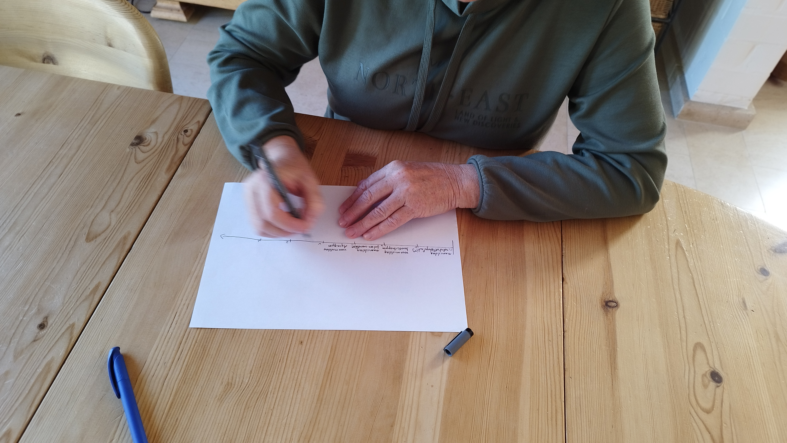
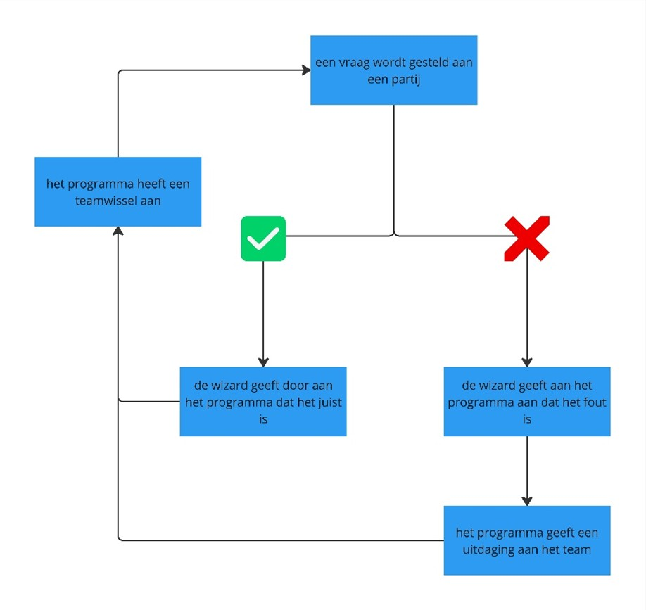

# BRIQ
Hoe kunnen 65-plussers samengebracht worden om aan multisensoriële oefeningen te doen?

*Projectteam: Kasper Stas, Joachim Waeyaert*

22/05/2025

## Samenvatting
Dementie wordt vaak behandeld in plaats van te voorkomen, terwijl preventie juist essentieel is. Uit wetenschappelijk onderzoek blijkt dat een combinatie van cognitieve en fysieke stimulatie kan bijdragen aan het uitstellen van dementie (Venesson, 2023)[^2]. Daarnaast toont onderzoek aan dat sociale interactie een positieve invloed heeft op de cognitieve vaardigheden. Wanneer dergelijke onderzoeken zijn uitgevoerd binnen de doelgroep, werd duidelijk dat motivatie een cruciale rol speelt. Regelmatig gebruik blijkt namelijk moeilijk zonder een sterke drijfveer.

Om deze motivatie te stimuleren, werd onderzocht hoe deze geïntegreerd kan worden in producten zoals de Briq. Drie belangrijke motivatiefactoren kwamen naar voren. Ten eerste is het belangrijk om aan te sluiten bij de interesses en hobby’s van mensen. Ten tweede speelt sociaal contact een grote rol, aangezien veel ouderen dit als een zeer belangrijk aspect ervaren. Tot slot is gebruiksvriendelijkheid van belang; het product moet niet te innovatief of ingewikkeld zijn, omdat dit voor oudere gebruikers een barrière kan vormen.

Door deze drie aspecten te combineren met een multisensorische aanpak, kan dementie bij gezonde 65-plussers mogelijk worden uitgesteld. Dit benadrukt het belang van preventieve maatregelen die zowel stimulerend als toegankelijk zijn voor ouderen.

  

> [!NOTE]
> - Links naar volledige protocollen en reports zijn te vinden onder de [bijlagen](#bijlagen).
> - Ruwe data zoals foto's, video-opnames en diepgaandere dataverwerking zijn te vinden in de bijhorende protocollen en reports.
> - Volledige python codes zijn terug te vinden in de map [src](/src).
> - De 3D-modellen zijn terug te vinden in de map [cad](/cad)
> - De figma bestanden zijn terug te vinden in de map [figma](/figma).

## Introductie
Het project ‘Briq’ is ontstaan vanuit het thema ‘Healthy Aging’, waarbij gezocht wordt naar manieren om zowel fysiek als mentaal gezond ouder te worden. Dit thema is geïnspireerd door Ronnie Gardiner, een jazzdrummer die merkte dat drummen niet alleen zijn stemming verbeterde, maar ook zijn motoriek en cognitieve vaardigheden stimuleerde. Deze inzichten leidden tot de ontwikkeling van de Ronnie Gardiner Methode (RGM), een oefenmethode die ritme en muziek gebruikt om meerdere hersengebieden tegelijk te activeren. De methode stimuleert motoriek, spraak en cognitie, en wordt momenteel toegepast in klinische omgevingen, bijvoorbeeld bij revalidatie van neurologische aandoeningen.
Onderzoek[^2] wijst uit dat een combinatie van fysieke en cognitieve uitdagingen elkaar versterkt. In 2023 benadrukte Julien Venesson dit met zijn onderzoek naar myokines – hormonen die vrijkomen door spieractiviteit en bijdragen aan de vorming van nieuwe hersencellen (Venesson, 2023). Dit bevestigt de kracht van beweging in combinatie met mentale stimulatie, zoals toegepast in de RGM-methode.

> "Myokines: het verjongende hormoon dat door onze spieren wordt geproduceerd" (Venesson, 2023)[^2].

De _design challenge_ binnen het project 'Briq' is om een slim product te ontwikkelen dat de RGM-methode op een vernieuwende en toegankelijke manier implementeert. Het doel is om een product te ontwerpen dat niet alleen geschikt is voor klinische toepassingen, maar ook gezonde ouderen stimuleert om mentaal en fysiek actief te blijven. 

> [!IMPORTANT]
> Randvoorwaarden:
> - Het product moet fysieke en digitale componenten bevatten.
> - Het product moet zowel het fysiek als het cognitieve prikkelen.
> - Het product moet zelfstandig kunnen gebruikt worden door ouderen.

Het betrekken van verschillende stakeholders, naast de eindgebruiker, is een cruciaal onderdeel om dit project tot een goed einde te brengen. De belangen van deze stakeholders zijn in kaart gebracht met een _stakeholder map_ en waarbij de twee belangrijkste partijen verder zijn geanalyseerd met behulp van de _Innovatrix_.

  
  

### Werking
Het product bestaat uit twee componenten. Enerzijds de luidsprekermodule, anderzijds de  kleurmodule. De luidsprekermodule wordt aan de zijkant van het net geplaatst. Op dit moment verschijnt er op het scherm een keuzemenu die de verschillende thema's van het quizegedeelte bevat (eg. sport, literatuur, geschiedenis,...). Eens de thema's zijn gekozen beginnen de spelers met het spel (eg.tennis, badminton,...). De luidsprekermodule geeft beide teams beurtlings een meerkeuze vraag over de gekozen thema's. De spelers beantwoorden deze vraag met A, B of C die door een spraakherkenningsmodule wordt geregistreerd. Indien de spelers juist antwoorden wordt de beurt doorgeschoven naar het andere team. Wanneer de spelers fout antwoorden worden ze een uitdaging opgelegd, wat een nadeel ten opzichte van het andere team is, door middel van een kleur. Deze kleur heeft een corresponderende opdracht wat voor het spel begint wordt meegegeven met de spelers. 

## Methodologie
Om structuur aan te brengen in het ontwerpproces werd er gebruik gemaakt van een duidelijke methodologie, die het eerste semester opdelen in twee grote fasen. De focus lag hierbij altijd op de gebruiker. De opzet van deze methodologie was ontworpen om zo veel mogelijk inzichten te verkrijgen om het ontwerp te verbeteren en verder te ontwikkelen.

  
  
### Discovery
De eerste fase werd gestart door een heldere probleemstelling te formuleren. Dit was noodzakelijk om het probleem goed af te bakenen en gerichte stappen te kunnen zetten. Tijdens deze fase werden benchmarks uitgevoerd om te onderzoeken wat er al op de markt beschikbaar was. Dit gaf een overzicht van de bestaande oplossingen en liet zien waar verbeteringen mogelijk waren. Daarnaast werden er ook user interviews gehouden om de gebruiker beter te begrijpen. Deze gesprekken gaven inzicht in de problemen en uitdagingen die zij ondervonden, wat essentieel was om de problemen goed te kunnen definiëren. Door deze aanpak kreeg het ontwerpproces meteen een gerichte focus, wat cruciaal was voor de volgende fasen.

### Definition
In de daaropvolgende fase werd het concept ontwikkeld op basis van de resultaten uit de Discovery fase. Dit concept was bedoeld om in te spelen op de geïdentificeerde problemen en een oplossing te bieden. Het concept werd vervolgens onderworpen aan verschillende concepttesten om te valideren of het daadwerkelijk effectief was. Deze testen gaven waardevolle feedback die het mogelijk maakte het concept verder te verfijnen en te verbeteren. Door iteratief aanpassingen te maken, werd het ontwerp steeds meer afgestemd op de behoeften van de gebruiker. Het resultaat van deze fase was een lijst van design requirements, die de basis vormde voor de verdere ontwikkeling van het product.

## Discovery
In dit onderdeel wordt onderzocht wat zich binnen de probleemruimte bevindt en of er mogelijke oplossingen voor deze kwesties gevonden kunnen worden. Om inzicht te krijgen in de probleemruimte worden enerzijds interviews afgenomen om te begrijpen hoe mensen het probleem ervaren, en anderzijds wordt gekeken naar bestaande oplossingen op de markt en de hiaten die benut kunnen worden.
### Doelstellingen
Een duidelijke ‘how might we’ bekomen

### Materiaal & methoden
-	Benchmarking
-	User interviews
  
### Resultaten
#### User Interviews (N=4)
Tijdens de gebruikersinterviews werden voornamelijk algemene aspecten besproken die aangestuurd werden door concrete vragen. Wanneer bepaalde vragen bij specifieke respondenten meer relevant bleken, werd daar dieper op ingegaan. Uit de interviews kwam naar voren dat de ene respondent het uitstellen of voorkomen van dementie als een belangrijke motivatie beschouwde, terwijl anderen zich daar minder zorgen over maakten. Voor deze laatste groep werd duidelijk dat hun motivatie vaak voortkwam uit persoonlijke interesses en hobby’s. Als deze interesses aanwezig waren, gaven ze aan gemotiveerd te zijn om deel te nemen aan “Aging Young”. Er werd verder onderzocht welke andere factoren, naast persoonlijke interesses, als belangrijke motiverende elementen zouden kunnen dienen.
Een van de belangrijke factoren die naar voren kwam, is het sociale aspect. Een respondent gaf aan dat veel kennissen van 65 jaar en ouder zich regelmatig eenzaam voelen. Voor hen zou het sociale aspect een sterke motivatie zijn om deel te nemen aan "Aging Young". Onderzoek[^1] ondersteunt dit, aangezien het blijkt dat ouderen die regelmatig in contact staan met vrienden of kennissen beter presteren op cognitieve tests dan degenen die minder sociale interactie ervaren (Bohn, 2021).
Daarnaast werd het belang van de gebruiksvriendelijkheid van de technologie benadrukt. De moderne, vaak complexe digitale wereld wordt door deze doelgroep als frustrerend ervaren. Respondenten gaven aan dat ze behoefte hadden aan producten die herkenbare, nostalgische elementen bevatten – producten die ze kunnen gebruiken of eenvoudig kunnen leren bedienen. De hedendaagse technologie wordt vaak als te ingewikkeld en te vernieuwend ervaren, wat leidt tot frustratie en afkeer bij deze groep.

  
  

#### Benchmarks (N=10)
Het doel van het marktonderzoek was om te onderzoeken welke aspecten van het "Aging Young"-concept al aanwezig zijn op de markt en welke van deze aspecten gebruikt of verbetert kunnen worden. Hiervoor werden verschillende bestaande producten of methodes onderzocht en hun voor-en nadelen geanalyseerd. 
Het viel op dat er veel cognitieve en fysieke oefeningen beschikbaar zijn, maar dat de combinatie van beide vaak beperkt is. Een belangrijk kenmerk van "Aging Young" is dat zowel het fysieke gedeelte intensief genoeg moet zijn, als het cognitieve gedeelte prikkelend genoeg. In veel gevallen blijkt het cognitieve gedeelte voldoende prikkeling te bieden, maar blijft het fysieke aspect niet intensief genoeg. Dit kan verklaard worden door de context waarin deze producten of oefenmethoden doorgaans worden toegepast, vaak in zorginstellingen zoals verpleeghuizen. Daar zijn de bewoners vaak niet mobiel genoeg om intensieve fysieke oefeningen uit te voeren of bevinden zij zich al in een gevorderd stadium van dementie. Met de Briq willen we echter juist focussen op mensen die nog in staat zijn om intensieve fysieke activiteiten uit te voeren en die thuis wonen, zonder de hulp van een zorgverlener of instructeur.
Een ander opvallend aspect was dat er vaak geen aandacht wordt besteed aan de motivatie van gebruikers om regelmatig met de producten of oefeningen te blijven werken, vooral wanneer er niemand aanwezig is om hen aan te moedigen of te begeleiden. Om hier meer inzicht in te krijgen, werd er tijdens de interviews (zie ‘user interviews’) verder onderzocht wat de drijvende kracht is achter de motivatie van gebruikers om actief betrokken te blijven bij deze producten.

  
  

  

### Conclusies & implicaties
Een product kan zo ontworpen worden dat het zowel cognitieve als fysieke activiteit bevordert, wat kan bijdragen aan het uitstellen of voorkomen van dementie. Maar zal het product daadwerkelijk gebruikt worden? Uit het onderzoek in de discovery-fase blijkt duidelijk dat, wanneer de interesses van de gebruiker niet worden aangesproken, het gebruik van het product waarschijnlijk beperkt zal zijn, waardoor de effectiviteit ervan vermindert. Om ervoor te zorgen dat het product aanspreekt, is het dus belangrijk om verschillende interesses en motivaties binnen één product te integreren.
Een deel van de 65-plussers is alleenstaand, waardoor het sociale aspect een belangrijke motiverende factor kan zijn. Veel sportieve hobby’s bieden al dit sociale aspect, zoals tennis, badminton en pingpong.
Daarnaast is het algemeen bekend dat frustraties veel zwaarder wegen dan positieve emoties. Om frustraties te verminderen, moet er specifiek gekeken worden naar hoe het product zo gebruiksvriendelijk mogelijk kan worden gemaakt. Dit kan bereikt worden door de interface duidelijk en herkenbaar te maken, het implementeren van tutorials en het gebruik van duidelijke signifiers. 
Op de markt zijn er veel multisensorische producten waarbij de intensiteit van de fysieke activiteit onvoldoende is. Het combineren van een voldoende hoge fysieke intensiteit met cognitieve stimulatie is essentieel om deze gap te vullen.

**Hoe kunnen 65-plussers samengebracht worden om aan multisensoriële oefeningen te doen?**

> [!IMPORTANT]
> Design Requirements:
> - D1.1 Het product dient in een sociale omgeving te kunnen gebruikt worden.
> - D2.1 Het product dient een tutorial te bevatten.
> - D2.2 Er moeten herkenbare kenmerken voor de gebruiker aanwezig zijn in het product.

## Definition
In deze fase werd er verder gewerkt op de conclusies uit de discovery fase. Aan de hand van deze inzichten begon de ontwikkeling van de eerste conceptuele prototypes die vervolgens enkele test waves ondervonden. Omdat het concept op dit moment bestond uit twee eerder aparte producten, de app en het toestel, werd er enkel verder gewerkt met het toestel om zo de focus en tijd goed te kunnen verdelen. Er was voor het toestel gekozen omdat dit meer de essentie van de opdracht weerspiegelde.

  
  

### Doelstellingen
In dit deel van het ontwikkelingsproces de concepten verfijnen. Dit werd gedaan aan de hand van twee _Wizard of Oz_ testen. Dit resulteert in een duidelijke _"How can we"_ om verder mee aan de slag te gaan in het tweede semester.

  

### Materiaal & methoden
Dit concept werd getest via twee gebruikerstesten, uitgevoerd tijdens tennis- of badmintonspel om een hoge ecologische validiteit te waarborgen. Beide testen volgden de _Wizard of Oz_-methode in combinatie met het _think aloud protocol_ (TAP). Twee onderzoekers voerden de testen uit, waarbij zij de rol van _Wizard_ of observator vervulden. Na afloop werd de verzamelde data geanalyseerd.

De eerste test evalueerde of het concept sterk genoeg was voor verdere ontwikkeling. De _Wizard_ gebruikte gekleurd papier om kleuren weer te geven, terwijl een quiz het vragengedeelte testte. De observator noteerde gedachten en handelingen van de respondenten. Nadien werden aanvullende vragen gesteld.

Na bevestiging van het concept werd een tweede prototype ontwikkeld. Ook dit prototype was primitief vanwege de vroege ontwikkelingsfase. De test onderzocht de plaatsing van kleuren en de luidspreker. De Wizard bediende bij deze test alles op afstand. Een ledstrip toonde kleuren op verschillende posities aan het net. De respondenten speelden badminton en riepen de kleur wanneer deze veranderde. De luidspreker werd op verschillende veldzijden getest door quizvragen te stellen. De observator noteerde opnieuw de gedachten en handelingen van de respondenten.

### Resultaten
#### Wave 1 (N = 4)
Tijdens de eerste testwave werden enkele problemen snel duidelijk. Aanvankelijk stond de Wizard aan het net (figuur links) om vragen te stellen en kleuren met de bijbehorende straf weer te geven. Omdat spelers vaak vroegen de vraag te herhalen, verplaatste de Wizard zich naar de kant van de spelers die de vraag kregen (figuur rechts). Dit verminderde het aantal herhalingsverzoeken aanzienlijk, wat ook werd bevestigd door de respondenten. Zij gaven aan open te staan voor deze aanpak, mits de vragen duidelijk hoorbaar waren.

  
  

Bij het testen van de kleuren ontstonden ook problemen. Respondenten keken niet weg van de bal om de kleur te zien, wat ze toeschreven aan de competitieve aard van het spel. Zelfs bij recreatief spelen vonden zij dat competitie niet mocht belemmerd worden. Daarnaast werd de juiste straf vaak te laat of niet toegepast omdat respondenten de juiste combinaties niet meer wisten. Straffen mochten bovendien niet te hinderend zijn, omdat dit het spelplezier noemenswaardig verminderde. Hoewel de respondenten het idee waardeerden, veroorzaakte het rudimentaire prototype enige frustraties, wat hun enthousiasme mogelijk beïnvloedde.

Bij deze testwave stonden de respondenten open voor het idee, maar er waren ook wel frustraties. Doordat het concept een zeer rudimentair prototype had, heeft dit waarschijnlijk ook een invloed op het enthousiasme van de respondenten.

#### Wave 2 (N = 6)
Bij de tweede testwave zegde de oorspronkelijke testgroep af wegens ziekte. Door feestdagen, waardoor de respondenten enkele weken niet tennisten, en aankomende examens werden nieuwe respondenten tussen 18 en 23 jaar ingeschakeld. Om de validiteit van de test te verhogen droegen zij oordopjes om de hardhorigheid uit wave 1 na te bootsen.

  
  

  
  

De tests wezen op een minimaal verschil in hoorbaarheid tussen verschillende luidsprekerposities. De voorkeur ging echter naar de frontale positie, mede omdat verbindingsproblemen bij een achterste positie de spelervaring verstoorden. Respondenten raakten gefrustreerd als vragen niet snel genoeg achter elkaar kwamen, wat de voorkeur voor de frontale opstelling versterkte. Ook waren de boxen wederom niet sterk genoeg om altijd de vraag duidelijk te verwoorden. Door omgevingsgeluid werd de vraag soms niet gehoord.

Bij het weergeven van kleuren bleek dat dit vaak afleidde van het spel. Toch vonden de respondenten dat een feller verlichte ledstrip, bevestigd bovenaan het net, de kleuren goed zichtbaar maakte zonder de aandacht van het spel af te leiden. Dit voldeed aan de eisen uit wave 1. Ze suggereerden ook dat de kleur geïntegreerd kon worden in een interactief spelonderdeel, zoals het pluimpje of racket, omdat deze altijd de meeste aandacht krijgen tijdens het spel.

### Conclusies & implicaties
Uit deze twee gebruikerstesten zijn er enkele belangrijke elementen voortgekomen om zo het product op te bouwen.
1)	De vragen moeten duidelijker aankomen. Dit kan door ze luider af te spelen of van dichterbij.
2)	De kleur wordt zodanig weergegeven dat deze vanuit een ooghoek zichtbaar is, zonder de aandacht van de bal af te leiden. Mogelijke opties zijn een LED-strip op het net, een luidspreker die de kleur aankondigt, of integratie in een interactief spelelement. Een pluimpje is afgewezen vanwege beperkte toepasbaarheid in andere netsporten zoals tennis en mogelijke duurzaamheidsproblemen.
3)	De straffen moeten niet te moeilijk gemaakt worden. Het is belangrijker dat de link wordt gelegd met wat er moet gebeuren in plaats van de moeilijkheidsgraad.
4)	Volgende prototypes moeten meer ontwikkeld worden om zo de geloofwaardigheid van het concept te verhogen.
5)	De positie van de speakers is het best gepositioneerd onder het net, wijzend naar beide partijen (2 speakers).
6)	Onderling gepraat tussen de partijen over wat het antwoord van de vraag zou moeten zijn zorgt voor onduidelijkheden over wat hun definitief antwoord is. Indien we in de toekomst willen werken met AI recognition zal het moeilijk zijn om hierin te filteren.

> [!IMPORTANT]
> Design Requirements:
> - D3.1	De strafmechanismen mogen geen grote impact hebben op het spel.
> - D3.2	De puntenregistratie moet soepel en foutloos verlopen.
> - D3.3	De spraakmodule moet luid en duidelijk zijn.
> - D3.4	De vragen mogen maximaal één regel lang zijn.
> - D3.5	Tussen de vragen mag er maximaal tien seconden pauze zitten.
> - D3.6	Het vermelden van de uitdaging moet duidelijk zijn

# Developing fase 
In deze fase wordt het oorspronkelijke concept verder ontwikkeld tot een fysiek product. Dit proces is opgedeeld in verschillende fasen, waarbij telkens tests worden uitgevoerd met de doelgroep. Op deze manier wordt het product op een gerichte en gebruiksvriendelijke manier geoptimaliseerd tot een multisensoriële ervaring.

Tijdens het ontwikkelproces wordt na grondig overleg besloten om het gebruik van kleuren achterwege te laten. Analyses tonen aan dat kleuren weinig tot geen invloed hebben op de effectiviteit van het product. Door dit element te elimineren, kan de focus worden gelegd op de essentiële aspecten, namelijk:

**Duidelijke communicatie van vragen:** Zorgen dat vragen helder en verstaanbaar worden overgebracht naar de gebruiker.
**Registratie en validatie van antwoorden:** Het correct vastleggen en evalueren van gebruikersreacties zonder dat dit het spelverloop belemmert of het speelplezier vermindert.
**Duidelijke UI bij keuze van de vragen:** Het gebruik van de console waarbij je de type vragen kan instellen moet duidelijk en simpel zijn om mee te werken.

Uit eerdere fasen, met name de Discovery-fase, blijkt dat de helderheid van de vraagstelling een grote impact heeft op de gebruikerservaring en het spelplezier. Daarnaast wordt vastgesteld dat een goed ontworpen gebruikersinterface (UI) cruciaal is. Deze UI moet de mogelijkheid bieden om het type vragen te selecteren en eventueel een puntensysteem te integreren, waardoor een competitief element wordt toegevoegd aan het spel.
**Beoogde functionaliteit tot nu toe:**
Het systeem bestaat dus uit een console met een geïntegreerde microcomputer die de vragen valideert, registreert en doorstuurt. De vragen worden vervolgens via een geluidsuitvoer naar de gebruiker overgebracht.

## Develop 1 (N=4)
### Doelstellingen
De eerste develop test is om te kijken of de oortjes een goede impact hebben op de gebruikservaring. Het is noodzakelijk dat de gebruikers de vragen goed kunnen horen evenals elkaar. Indien de communicatie wordt belemmerd tussen de spelers heeft dit een enorme impact op het tennissen en het plezier ervan. Naast het technische van de oortjes is het belangrijk dat de vragen door het programma klaar en duidelijk aankomen bij de respondent. In de vorige testen was duidelijk dat een te moeilijke uitdaging het spel verhinderde. Het doel in deze wave is om de uitdagingen op het juiste niveau te brengen zodat de uitdagingen niet demotiveren om het product te gebruiken.

### Materiaal en methoden
Tijdens de eerste ronde van de Develop-fase werd de vraag gesteld of er alternatieve methoden zijn om de vragen duidelijker over te brengen naar de gebruikers. In de tweede testfase (Wave 2 van de Definition-fase) werd vastgesteld dat de oorspronkelijke opzet met luidsprekers niet optimaal was. Het omgevingsgeluid bleek moeilijk te controleren, en bovendien varieerden de gehoorcapaciteiten van de gebruikers. Daarom werd besloten om de vragen via draadloze oortjes te formuleren. In de eerste Develop-fase werd deze methode vervolgens getest.

Voor deze test is er een pythonscript ontwikkeld. Deze versie van het script legt de focus op de text-to-speech module van de vragen. De werking van het script is terug te vinden in onderstaande flowchart. Aangezien het script nog niet ten volle werkende was, werd deze bediend door een _Wizard_. De vier testpersonen krijgen allemaal een oortje die via bluetooth verbonden zijn aan de laptop die de _Wizard_ bediend. In dit python script zit een lijst aan vragen en uitdagingen verwerkt. Deze uitdagingen worden op haalbaarheid getest.

  

Na deze test wordt er met de gebruikers nog kort samengezeten om enkele vragen te overlopen. Een diepgaandere analyse is te raadplegen in [bijlage 10](https://ugentbe-my.sharepoint.com/:w:/g/personal/kasper_stas_ugent_be/EaXPK_wpEgFAmV5XwKpGdbABpYaKwYSgQxv-ZS_ocufr3A?e=Zv4NPD).

### Resultaten
#### Oortjes
De oortjes geven een betere ervaring dan de luidspreker. De vragen zijn goed verstaanbaar waardoor het spel soepel gespeeld kan worden. Er wordt veel minder gevraagd om de vraag opnieuw te herhalen. Desondanks zijn er enkele problemen met de oortjes. Doordat de bluetooth verbinding niet altijd stabiel is komt het geluid krakend aan wat leidt tot het moeten herhalen van een vraag. Bij te bruuske bewegingen vallen de oortjes uit de oren wat het spel hindert. 

#### Uitdagingen
De uitdagingen zijn duidelijk om uit te voeren. Deze duidelijkheid en beperkte hinder die de uitdaging toebrengt aan het tennissen zorgen voor een positieve ervaring. 

#### Pythonprogramma
De text-to-speech module werkt goed, de spelers kunnen de vragen en uitdagingen goed verstaan. Hoe dan ook komen er enkele technische beperkingen met zich mee. PyGame had af en toe een onderbreking. Dit verstoort de continuïteit van het spel. Deze storing kan te wijden zijn aan de beperkte wifi verbinding. De sporthal waar de test is afgenomen is volledig uit beton. 

### Conclusies en implicaties
Deze test toont aan dat er veel potentieel zit in het gebruik van oortjes. De continuïteit van het spel blijft hoog hierdoor. Deze manier zorgt ervoor dat de add-on die BRIQ aanbiedt wordt geapprecieerd en gewaardeerd. Om deze continuïteit te houden is een stabiele bluetooth verbinding tussen de centrale console en de oortjes essentieel. De ergonomie van de oortjes zit nu niet goed. Bij deze test zat het in de oren. 
De text-to-speech module geeft een duidelijke vraag weer. Op deze methode wordt er verdergebouwd. Tijdens de test wordt duidelijk dat de gebruikers omwille van verschillende accenten en dialecten anders antwoorden. Het programma zal een fluïde manier moeten hebben om de antwoorden te registreren. 

  
  

> [!IMPORTANT]
> Design Requirements:
> - D3.7	Het programma moet stabiel zijn
> - D3.8	De text-to-speech moet duidelijk zijn zonder kraken
> - D4.1	De bluetoothverbinding moet stabiel zijn
> - D4.2	De bluetoothverbinding moet minstens 15m kunnen overbruggen
> - D4.3	De oortjes moeten tijdens bewegen stevig vast blijven zitten

### Besturingsmodule
Tijdens de eerste ontwikkelfase (Develop 1) werd een deel van de back-endlogica ontwikkeld in Python, met als doel de eerste functionele testen uit te voeren. Deze basis werd doorheen de daaropvolgende ontwikkelfases verder verfijnd en uitgebreid.

De applicatie is modulair opgebouwd en bestaat uit meerdere onderling gekoppelde scripts. Het programma wordt opgestart via het script genaamd "main", dat als hoofdmodule fungeert. Bij het starten van dit script wordt eerst een splashscreen geactiveerd dat het logo op het scherm toont. Na afloop van deze animatie schakelt het systeem automatisch over naar het verbindingsscherm.

In dit scherm worden twee knoppen weergegeven waarmee verbinding kan worden gemaakt met de draadloze oortjes. Bij het activeren van een knop zoekt het systeem automatisch het bijbehorende MAC-adres op via de Raspberry Pi en probeert hiermee verbinding te maken. Aangezien de microcomputer die in het Briq-project werd gebruikt niet in staat is om gelijktijdig meerdere audioapparaten aan te sturen, werd gekozen voor het gebruik van twee afzonderlijke Bluetooth-adapters. Elke adapter ontvangt een apart signaal en wordt door de microcomputer herkend als een individuele Bluetooth-verbinding.

Zodra beide oortjes met succes verbonden zijn, schakelt het programma over naar het keuzescherm voor de spelcategorieën. Na het selecteren van een categorie kan het spel vervolgens worden gestart.

**Werking quiz game:**

  

Het belangrijkste probleem dat zich voordeed, was dat er vaak meerdere manieren waren om een vraag te beantwoorden. Dit was niet alleen te wijten aan verschillende accenten, maar ook aan de verscheidenheid aan mogelijke antwoorden. Een voorbeeld hiervan is de vraag: "Wie was de koning van België in 1964?" Deze vraag kan beantwoord worden met "Koning Boudewijn de Eerste" of "Boudewijn Eén".

Tijdens de definition- en ontwikkelfase werd duidelijk dat de frustraties die tijdens het spelen ontstonden, een aanzienlijke invloed hadden op het spelplezier. Dit probleem moest dan ook zeker worden opgelost om de algehele gebruikerservaring te verbeteren.

De oplossing voor dit probleem werd gevonden door het gebruik van de library 'SentenceTransformer'. Deze library zet zinnen om in numerieke reeksen (vectoren) die de semantische betekenis van de zin representeren. Zowel de vraag als het antwoord worden op deze manier omgezet in een vector. Met behulp van cosinus-similariteit worden de twee vectoren vergeleken op basis van hun richting. Wanneer de richting van beide vectoren binnen een vooraf gedefinieerde drempelwaarde ligt, wordt het antwoord alsnog als correct geaccepteerd, ondanks mogelijke variaties in formulering.

De gewenste gebruikersinterface is ontworpen in Figma en grondig onderzocht tijdens de ontwerpfase van develop 3. Voor het prototypen en testen van de programmalogica is gekozen voor een vereenvoudigde interface, ontwikkeld met behulp van Tkinter. Dit om wat tijd te besparen in het testen van de code. 

De huidige versie van de interface bevat nog niet het uiteindelijke ontwerp uit Figma, aangezien deze fase voornamelijk gericht is op het aantonen van de functionele werking van het programma. Het is de bedoeling dat uiteindelijk de Figma-interface volledig geïntegreerd wordt in de Python code.

Om dieper in te gaan op de technische werking van het programma is een aparte handleiding opgesteld. Deze handleiding biedt een overzicht van de gebruikte code, legt stap voor stap de werking uit en bevat instructies voor installatie en gebruik. Die handleiding kunt u terugvinden onder [bijlage 16](https://ugentbe-my.sharepoint.com/:w:/g/personal/kasper_stas_ugent_be/EZiMYHiFnaRJllkjAzpcveQB6Tu8fkxD4TQldyxbMwVdAw?e=pHDd6y)

## Develop 2 (N=4)
### Doelstellingen
In de tweede fase van het ontwerpproces wordt de focus gelegd op de ergonomie van het oortje. Het is van groot belang dat deze tijdens het sporten goed zitten zonder irritatie te veroorzaken na een langere tijdsperiode (meer dan 1u). Desondanks is het vereist dat de oortjes bij bruuskere bewegingen niet uit het oor vallen.

### Materiaal en methoden
Voor deze develop fase worden de oortjes gemaakt uit een stuk ijzerdraad met daarrond plasticine. Deze methode zorgt ervoor dat er op een makkelijke en snelle manier veel verschillende vormen geëxploreerd kunnen worden. Aansluitend is dit ook ideaal om organische vormen te prototypen. Omwille van het feit dat de BRIQ doos gemaakt wordt met als doel dat het wordt uitgeleend door sportcentra en/of rusthuizen worden de oortjes ontworpen vanuit het idee dat het via bone conduction werkt. Dit zit niet in het oorkanaal wat op vlak van hygiëne een belangrijk pluspunt is.

Twee van de oortjes (eerste en laatste oortje op onderstaande foto) zijn hetzelfde van vorm. Het enige verschil tussen deze twee is de grootte van het oortje. Beide oortjes rusten op de bovenkant van het oor. Het derde prototype (tweede oortje van links) gaat ook langs de bovenkant van het oor maar maakt gebruik van een beugel die rond het hoofd gaat. Deze beugel zit in de test om te zien of het voor meer stevigheid zorgt tijdens het sporten. Het laatste oortje (derde oortje van links) gaat langs de onderkant van het oor. De bovenkant heeft een klein haakje zodat het blijft hangen, het speakergedeelte gaat rond de onderkant tot aan het bot voor de boneconduction oortjes

  
  

### Resultaten
Tijdens het testen van verschillende oortjesontwerpen kwamen duidelijke voorkeuren en knelpunten naar voren. Het model met een beugel rond het oor kreeg de meeste kritiek. Gebruikers gaven aan dat het lastig was aan te brengen, onvoldoende stabiel zat en fysieke ongemakken veroorzaakte, zoals schuren of druk tegen de schedel. Ook werd het ontwerp als omslachtig en zwaar ervaren, met het risico dat het bij beweging loskomt.

Het oortje dat onder het oor door loopt, werd over het algemeen als comfortabeler beschouwd dan het beugelmodel, maar ook hier waren er opmerkingen over een losse pasvorm en een moeilijke plaatsing. De positionering bleek niet intuïtief en bood onvoldoende stabiliteit tijdens fysieke activiteit.

Het model dat over de bovenkant van het oor loopt, presteerde het best. Dit ontwerp kreeg positieve feedback op vlak van stevigheid, comfort en stabiliteit. Hoewel er lichte hinder werd ervaren bij het dragen van een bril of tijdens het aanbrengen, werd dit model het vaakst als geschikt voor beweging omschreven.

Tot slot scoorde het kleinere oortje dat eveneens boven het oor loopt wisselend. Het verraste gebruikers qua comfort, maar bleek onvoldoende stevig voor sportieve contexten. Bij de beweging gleed het vaak weg, wat de bruikbaarheid aanzienlijk beperkte.

  
  
   

### Conclusies en implicaties
Uit de gebruikerstest blijkt dat het oortje dat over de bovenkant van het oor loopt, het meest geschikt is voor ouderen die actief zijn, bijvoorbeeld tijdens sporten zoals tennis. Dit model biedt een goede balans tussen comfort en stabiliteit. Andere varianten werden als te omslachtig, onvoldoende intuïtief of niet stabiel genoeg ervaren, wat ze minder geschikt maakt voor dynamisch gebruik.

Belangrijke succesfactoren bleken een universele pasvorm, eenvoudige en intuïtieve plaatsing, en een ontwerp dat vrij is van visuele of fysieke barrières. Toch moet er rekening worden gehouden met individuele gebruikerskenmerken zoals het dragen van een bril, verminderde motoriek of gevoelige huid. Deze factoren hebben een aanzienlijke impact op de gebruikerservaring en dienen meegenomen te worden in het definitieve ontwerp.

> [!IMPORTANT]
> Design Requirements:
> - D4.4	De oortjes dienen langs de bovenkant van het oor bevestigd te worden
> - D4.5	Het materiaal van de oortjes moet zacht en huidvriendelijk zijn
> - D4.6	De oortjes moeten compatibel zijn om te dragen met een bril
> - D4.7	De oortjes moeten intuïtief geplaatst worden
> - D4.8	De oortjes moeten universeel zijn
> - D4.9	De oortjes moeten licht zijn

## Develop 3 (N=4)
Tijdens de laatste fase van de ontwikkelingsronde lag de focus op de vormgeving van de behuizing van het uiteindelijke product en de interface die de interactie met de gebruiker faciliteert.

### Doelstellingen
In deze derde ontwikkelingsronde ligt de focus op het verbeteren van zowel de gebruikersinterface als de behuizing van het product. Het doel is om te onderzoeken welke interface zonder voorafgaande uitleg het eenvoudigst te gebruiken is door de doelgroep (65+), en welke fouten hierbij frequent voorkomen. Daarnaast wordt er gekeken naar welke visuele en fysieke elementen van de behuizing bijdragen aan een positieve gebruikerservaring op vlak van esthetiek, kwaliteit en gebruiksgemak. De resultaten uit deze ronde vormen een belangrijke basis voor het eindproduct.

### Materiaal en methoden
#### Interface
Om de Briq gebruiksvriendelijk te maken en bovendien frustraties weg te werken is een goede interface essentieel. Om die reden zijn er vier verschillende interfaces die getest worden. Per interface is er een andere insteek gebruikt. De eerste interface is gebaseerd op WhatsApp, een populaire app onder de ouderen (Sánchez-Juárez Pradal, 2019)[^3]. Het tweede prototype legt de focus op een interface die zeer basis is. Er zijn geen bepaalde aandachtstrekkers verwerkt in het scherm. Als derde interface wordt er onderzoek gedaan op google scholar naar papers over gebruiksvriendelijke interfaces voor ouderen (Lin, Hsieh, & Shiang, 2009; Zhao & Chen, 2020; Zhou et al., 2022)[^4][^5][^6]. Het vierde en laatste interface zwenkt meer af naar de sportcontext. Deze is gebaseerd op de populaire Strava app. Ook heeft deze interface nog een toevoeging, een coach die je door de verschillende schermen leidt. Voor een meer diepgaande analyse over de opbouw van de interface is deze raadpleegbaar in [bijlage 14](https://ugentbe-my.sharepoint.com/:w:/g/personal/kasper_stas_ugent_be/EWJNR97-HidJr0l_aQn86SYBAPjInbjvQXtynCUaRM3Meg?e=vYPmrd). 

  
  

  
 

De interfaces worden getest door op elk van de interfaces dezelfde opdracht uit te voeren. Deze opdracht staat gelijk met de gewone werking van het product, namelijk oortjes verbinden, een thema kiezen en uiteindelijk het spel starten. Elke interface wordt opgevolgd met een UMUX vragenlijst. Om volgorde-effecten tegen te gaan wordt gebruik gemaakt van een latijns vierkant als counterbalanceringsmethode.

#### Behuizing
Om een idee te krijgen over hoe een mooie behuizing kon worden uitgewerkt werd eerst en vooral iteraties gedaan op papier. Waarna een selectie van die iteraties in karton zijn uitgewerkt om een eerste tastbare indruk te krijgen van de behuizingen. 
De onderstaande afbeeldingen geven de uitgewerkte prototypes weer. Bij het eerste prototype is het scherm langs de bovenkant. De oortjes hangen vast aan de zijkant. Het tweede prototype maakt gebruik van een deksel om het scherm en oortjes te beschermen. Het laatste prototype heeft aparte schuifjes voorzien voor de oortjes.

  
  
  

In een volgende stap werd met behulp van Vizcom onderzocht welk gevoel het product moet overbrengen op de gebruiker. Dit gebeurde door het creëren van diverse moodboards die de gewenste sfeer en uitstraling visueel weergeven. Samen met het moodboard werd dan een foto van een van de prototypes upgeload, om dan aan de slag te gaan in een AI gestuurde foto bewerker waar je gebieden van het prototype kon aanduiden die er anders moesten uitzien. Zo werden onderstaande 'uitgewerkte' renders ontwikkeld om een nog betere look en feel te krijgen van hoe het er potentieel zou kunnen uitzien. Voor een uitgebreidere analyse van de Vizcom renders is deze raadpleegbaar in [bijlage 14](https://ugentbe-my.sharepoint.com/:w:/g/personal/kasper_stas_ugent_be/EWJNR97-HidJr0l_aQn86SYBAPjInbjvQXtynCUaRM3Meg?e=vYPmrd). 

  
  
  

  
  
  

Deze renders worden dan voorgesteld aan de doelgroep en met behulp van een decision matrix een beeld geschept over hoe zij de uitwerkingen van de producten inschatten en welk gevoel ze daarbij hebben. Met deze info kan dan aan de slag worden gegaan om een uiteindelijke behuizing te maken voor de Briq. 

### Resultaten
#### Interface
Alvorens de vragen uit de UMUX lijst te vergelijken wordt de Cronbach's alpha berekent om de betrouwbaarheid van de vragenlijst te verifiëren. Deze heeft een score van 0,93 wat wil zeggen dat de lijst betrouwbaar is.
De resultaten uit de UMUX vragenlijst geven een duidelijke verdeling weer in de verdeling van gebruiksvriendelijkheid tussen de interfaces. Gemiddeld gezien scoort de interface met als basis de papers het beste. De niet afleidende interface volgt als tweede gevolg door de Strava geïnspireerde interface. Verassingwekkend scoort de WhatsApp interface het slechts, met een gemiddelde score van 4,5. 

Naast de UMUX vragenlijst zijn er foutieve handelingen en bedenkingen van de respondenten neergeschreven. De interface gebaseerd op de papers wordt aanschouwd als makkelijk. Bij de niet afleidende interface drukken drie van de vier respondenten op de bluetooth statusknop in plaats van de verbindknop. De Strava interface had de moeilijkheid dat de respondent telkens naar het startscherm moet gaan om de opdracht verder te zetten. Dit leidt tot het meermaals verbinden van de oortjes en meermaals kiezen van een thema. Ook duurde het een tijd tegen dat de respondent doorhad dat hij moest terugkeren om verder te gaan. Ondanks de waarschuwing of alles was gelukt van oortjes verbinden en thema kiezen tikte een respondent verder zonder deze acties allemaal te volbrengen. Bij de WhatsApp interface heeft niemand van de respondenten een thema gekozen. Wanneer ze hierop gewezen werden werd beweerd dat deze optie er niet was bij drie van de vier.   

#### Behuizing
De scores in de decision matrix worden per gebruiker omgezet volgens onderstaande tabel.
| -- | -  | +- | +  | ++ |
|----|----|----|----|----|
| -2 | -1 | 0  | 1  | 2  |

In onderstaande tabel staan de totaalsom van elk kenmer per concept. Deze zijn op hun beurt opgeteld om de totaalsom per concept op te tellen. Al snel valt op dat er enige consitentie is tussen de concepten. De scores die per twee bij elkaar in de buurt liggen zijn telkens een Vizcom render vertrokken uit hetzelfde kartonnen prototype. 

|               |   |  |  |  |  |  |
|---------------|-----------|-----------|-----------|-----------|-----------|-----------|
| betrouwbaarheid | -1        | 7         | 2         | 1         | 6         | 5         |
| stevigheid     | 7         | 6         | 8         | 3         | 4         | 7         |
| elegantie      | 7         | 4         | -8        | 4         | 4         | -4        |
| sportief       | 0         | 3         | -7        | 3         | 7         | -5        |
| materiaal      | 2         | 6         | 0         | 1         | 5         | 4         |
| aantrekkelijk  | 6         | 5         | -5        | 4         | 7         | -2        |
| ergonomisch    | 4         | 8         | -1        | 3         | 7         | -4        |
| stijl          | 5         | 3         | -7        | 4         | 5         | -3        |
| **totaal**     | **30**    | **42**    | **-18**   | **23**    | **45**    | **-2**    |

  
  
   

### Conclusies & implicaties
#### Interface
Uit bovenstaande resultaten wordt duidelijk dat de interfaces die het best scoren degene zijn met grote knoppen en weinig afleidende informatie op het scherm. Een groot verschil tussen deze twee interfaces is het statussymbool van de bluetoothverbinding. Bij de paperinterface is dit een klein bolletje dat van rood naar groen verandert indien verbonden. Bij de niet afleidende interface is dit een grote cirkel. Uit de observatie wordt duidelijk dat deze cirkel een signaal afgeeft dat de gebruiker hierop moet tikken. 
Beide interfaces met de hoogste scores zijn lineaire interfaces. Dit soort interfaces hebben per deelopdracht een apart scherm. Pas wanneer deze deelopdracht is voltooid kan de gebruiker verder naar het volgende deel. De andere twee interfaces zijn matrix interfaces. Bij beide van deze interfaces duurde het langer om de opdracht te voltooien en was dit soms gepaard met de opdracht niet compleet te voltooien.
Het gebruik van de coach werkt omgekeerd dan gedacht. De coachfunctie leidde ertoe dat gebruikers onnodige handelingen uitvoerden of stappen herhaalden, wat tot frustratie leidde. Dit fenomeen kan verklaard worden aan de hand van de Cognitive Load Theory (CLT) van Sweller (1988)[^7], die verder werd uitgewerkt in latere publicaties (Sweller, Ayres, & Kalyuga, 2011)[^8].

Deze theorie onderscheidt drie soorten cognitieve belasting: intrinsieke, extrane en germane load. In dit geval verhoogde de coachfunctie de extrane belasting, omdat ze afleidde van de essentie van de taak zonder functionele meerwaarde te bieden. Dit verlaagt de beschikbare mentale capaciteit voor daadwerkelijke taakverwerking, wat de gebruikservaring negatief beïnvloedt. Op basis van dit inzicht werd beslist om de coachfunctie in het finale prototype weg te laten en te kiezen voor een lineaire, minimalistische interface, in lijn met de aanbevelingen vanuit CLT.

#### Behuizing
Uit de voorkeuren van de doelgroep blijkt duidelijk dat een behuizing met een deksel het meest gewaardeerd wordt. Dit kan duiden op een associatie met gebruiksgemak, bescherming van het product en een vertrouwd ‘doosje’-gevoel. De consistentie in scores tussen paren van concepten die gebaseerd zijn op hetzelfde kartonnen prototype, onderstreept dat de vorm en uitstraling van het basisontwerp sterk bepalend zijn voor de waardering.

Hoewel sommige concepten lager scoren op elegantie en stijl, toont de decision matrix aan dat stevigheid, ergonomie en aantrekkelijkheid belangrijke factoren zijn die positief bijdragen aan de totaalbeoordeling. Dit impliceert dat het uiteindelijke ontwerp een balans moet vinden tussen een robuuste, comfortabele vorm en een esthetisch aantrekkelijke uitstraling.

> [!IMPORTANT]
> Design Requirements:
> - D2.1	De interface heeft maximaal één functie per scherm
> - D2.2	De interface heeft knoppen die minstens 15mm x 20mm zijn
> - D2.3	De centrale console bevat een deksel
> - D2.4	De centrale console is gemaakt uit robuuste materialen
> - D2.5	De centrale console moet stevig gebouwd zijn
> - D3.9	Het programma verloopt lineair 
> - D3.10	De interface geeft duidelijke feedback bij acties
> - D3.11	De interface heeft geen afleidende elementen

## List of Design Requirements
| ID     | Design requirement                                                                    | Source         | Date     |
|--------|----------------------------------------------------------------------------------------|----------------|----------|
| **Groep 1** |  **Algemeen**                                                                          |                |          |
| D1.1   | Het product dient in een sociale omgeving gebruikt te worden                          | User interview | 20-Oct   |
| D1.2   | Het product dient zonder extra uitleg gebruikt te kunnen worden                       | User interview | 20-Oct   |
| D1.3   | Er moeten herkenbare kenmerken voor de gebruiker aanwezig zijn in het product         | User interview | 20-Oct   |
| **Groep 2** |  **Centrale console**                                                                  |                |          |
| D2.1   | De interface heeft maximaal één functie per scherm                                   | User test      | 18-May   |
| D2.2   | De interface heeft knoppen die minstens 15mm x 20mm zijn                              | User test      | 18-May   |
| D2.3   | De centrale console bevat een deksel                                                  | User test      | 18-May   |
| D2.4   | De centrale console is gemaakt uit robuuste materialen                                | User test      | 18-May   |
| D2.5   | De centrale console moet stevig gebouwd zijn                                          | User test      | 18-May   |
| **Groep 3** |  **Programma**                                                                         |                |          |
| D3.1   | De strafmechanismen mogen geen grote impact hebben op het spel                        | Concept test   | 08-Dec   |
| D3.2   | De puntenregistratie moet soepel en foutloos verlopen                                 | Concept test   | 08-Dec   |
| D3.3   | De spraakmodule moet luid en duidelijk zijn                                           | Concept test   | 08-Dec   |
| D3.4   | De vragen mogen maximaal één regel lang zijn                                          | Concept test   | 08-Dec   |
| D3.5   | Tussen de vragen mag er maximaal tien seconden pauze zitten                           | Concept test   | 27-Dec   |
| D3.6   | Het vermelden van de uitdaging moet duidelijk zijn                                    | Concept test   | 27-Dec   |
| D3.7   | Het programma moet stabiel zijn                                                       | User test      | 11-Mar   |
| D3.8   | De text-to-speech moet duidelijk zijn zonder kraken                                   | User test      | 11-Mar   |
| D3.9   | Het programma verloopt lineair                                                        | User test      | 18-May   |
| D3.10  | De interface geeft duidelijke feedback bij acties                                     | User test      | 18-May   |
| D3.11  | De interface heeft geen afleidende elementen                                          | User test      | 18-May   |
| **Groep 4** |  **Audiomodule**                                                                       |                |          |
| D4.1   | De bluetoothverbinding moet stabiel zijn                                              | User test      | 11-Mar   |
| D4.2   | De bluetoothverbinding moet minstens 15m kunnen overbruggen                           | User test      | 11-Mar   |
| D4.3   | De oortjes moeten tijdens bewegen stevig vast blijven zitten                          | User test      | 11-Mar   |
| D4.4   | De oortjes dienen langs de bovenkant van het oor bevestigd te worden                  | User test      | 04-May   |
| D4.5   | Het materiaal van de oortjes moet zacht en huidvriendelijk zijn                       | User test      | 04-May   |
| D4.6   | De oortjes moeten compatibel zijn om te dragen met een bril                           | User test      | 04-May   |
| D4.7   | De oortjes moeten intuïtief geplaatst worden                                          | User test      | 04-May   |
| D4.8   | De oortjes moeten universeel zijn                                                     | User test      | 04-May   |
| D4.9   | De oortjes moeten licht zijn                                                          | User test      | 04-May   |

## Finaal prototype
Na maanden van testen, bijsturen en ontwikkelen is het eindresultaat klaar: Briq – een speelse en doordachte trainingsmodule die fysieke activiteit en cognitieve stimulatie samenbrengt. Ontworpen voor 65-plussers, biedt Briq een laagdrempelige en motiverende manier om zowel lichaam als geest actief te houden. Het systeem legt de nadruk op eenvoud, plezier en sociale interactie, zonder in te boeten op functionaliteit of comfort.

### Centrale console
De console vormt het centrale punt van het systeem. Via een eenvoudig keuzemenu selecteert de gebruiker een thema en start het spel. De grote, duidelijke knoppen en het lineaire verloop maken de bediening vlot. Het ontwerp is robuust en intuïtief, wat zorgt voor vertrouwen bij de gebruiker. De afsluitbare behuizing beschermt het systeem en maakt het geschikt voor gebruik in sportieve omgevingen.

### Draadloze oortjes
Voor de auditieve begeleiding maakt Briq gebruik van bone conduction-oortjes. Deze technologie zorgt ervoor dat gesproken instructies helder en zonder afleiding worden weergegeven, zonder de oren af te sluiten. Het ergonomische ontwerp blijft goed zitten tijdens beweging en is ook bruikbaar in combinatie met een bril. De keuze voor draadloze oortjes draagt bij aan een opgeruimd en vrij gevoel tijdens het spel.

### Spelervaring
Briq combineert quizvragen met beweging, bijvoorbeeld tijdens het spelen van een netsport. Bij een goed antwoord gaat het spel naar het andere team; een fout antwoord resulteert in een korte, lichte uitdaging. Deze spelopzet stimuleert niet alleen het geheugen en reactievermogen, maar ook het groepsgevoel en de motivatie om te blijven meedoen. Door competitie en samenwerking te combineren ontstaat er een spelervaring die cognitief en fysiek prikkelt, zonder te overweldigen.

### Gebruiksvriendelijkheid
De interface is bewust eenvoudig gehouden. Grote knoppen, visuele en auditieve feedback en een herkenbare structuur zorgen ervoor dat gebruikers snel begrijpen hoe het systeem werkt. De interacties zijn lineair en duidelijk – een bewuste keuze om verwarring te vermijden. Briq is gericht op het versterken van zelfvertrouwen bij de gebruiker door technologie als hulpmiddel aan te bieden, niet als hindernis.

### Conclusie
Briq biedt een slimme, sociale én toegankelijke manier om ouderen actief te houden. Het systeem maakt preventieve stimulatie niet alleen haalbaar, maar ook aantrekkelijk. Door de combinatie van fysieke beweging, cognitieve uitdagingen en eenvoudige interactie toont Briq aan dat technologie perfect kan inspelen op de noden van een ouder wordende doelgroep – met plezier en gebruiksgemak als kernwaarden.

## Bill of materials
1. Hardware: LED-strips, speakers, microcontroller (arduino), voeding, basis arduino kit
2. Prototype-materiaal: karton, hout, PLA (3d-printen)

## Kritische reflectie
Sinds het samenstellen van de groepen is het project in een constante stroomversnelling terechtgekomen. Dankzij een gezamenlijke, kritische benadering heeft het gekozen concept doorlopend verfijning en verbetering ondergaan. Elk idee werd zorgvuldig geanalyseerd en getest, wat leidde tot een sterke basis voor verdere ontwikkeling. Ondanks onverwachte obstakels, zoals het last-minute afzeggen van de testgroep in een cruciale fase, is er adequaat en snel geschakeld naar een alternatief plan. Dit getuigt van een pragmatische houding en een flexibele werkwijze binnen het team.

Hoewel het alternatief niet direct de beoogde doelgroep betrof, werden de resultaten zorgvuldig en met een kritische blik geëvalueerd. Deze aanpak benadrukt het belang van een wetenschappelijke en methodische werkwijze, waarbij zelfs in moeilijke omstandigheden gefocust blijft op de kern van het project. Het efficiënte samenwerken en het vermogen om obstakels snel te overwinnen, hebben ertoe bijgedragen dat het project soepel en doelgericht kon blijven verlopen.

Een belangrijk inzicht dat naar voren is gekomen, is dat de veelzijdigheid van BRIQ – bedoeld voor alle netsporten – niet betekent dat testresultaten eenvoudigweg van de ene naar de andere sport overgezet kunnen worden. Zo brengt de kleinere omvang van een badmintonveld vergeleken met een tennisveld significante verschillen met zich mee in het testproces. Dit vraagt om een diepgaande analyse en een zorgvuldige benadering bij het trekken van conclusies en het formuleren van ontwerpvereisten. Het team moet blijven waken over de toepasbaarheid van deze eisen op meerdere netsporten en ervoor zorgen dat het uiteindelijke ontwerp robuust en veelzijdig genoeg is om aan de behoeften van verschillende doelgroepen te voldoen.

Kortom, deze reflectie benadrukt niet alleen de kracht van samenwerking en flexibiliteit binnen het project, maar ook het belang van een kritische en toekomstgerichte benadering bij de ontwikkeling van een innovatief product als BRIQ.

## Bijlagen
- Bijlage 1: [Discoveryfase user interview protocol](https://ugentbe-my.sharepoint.com/:w:/g/personal/joachim_waeyaert_ugent_be/Eccp6-tuJ7RIgDxTFJafTsUBjha0G01C07kuwLYuzL_5hg?e=EyJoAE)
- Bijlage 2: [Discoveryfase user interview report respondent 1](https://ugentbe-my.sharepoint.com/:w:/g/personal/joachim_waeyaert_ugent_be/ETShPN_411NNuFoKcluLLloBlKvgK6anIf66xyKFr2YVYA?e=tGJIf9) 
- Bijlage 3: [Discoveryfase user interview report respondent 2](https://ugentbe-my.sharepoint.com/:w:/g/personal/joachim_waeyaert_ugent_be/EX9dlNEBjz9Ep7ALpzGcafgBQYQuzKDekljJ-uAmMbQE1Q?e=86iySw)
- Bijlage 4: [Discoveryfase user interview report respondent 3 en 4](https://ugentbe-my.sharepoint.com/:w:/g/personal/joachim_waeyaert_ugent_be/EcoTCGuhVb5BuJcO8Id6Z2MB8CgIEz0BB_kHVZi0qELf9w?e=ZP3wUn)
- Bijlage 5: [Discoveryfase benchmarking protocol en report](https://ugentbe-my.sharepoint.com/:w:/g/personal/joachim_waeyaert_ugent_be/EVxuGJCil6NKqp4rx4swli4Bz6NNofoWt0LyqeWuUlmu3w?e=z1qCuJ)
- Bijlage 6: [Definitionfase wave 1 protocol](https://ugentbe-my.sharepoint.com/:w:/g/personal/kasper_stas_ugent_be/EYF02Lnx5_JLl-T0XP1DYy8BgK0_u3MWQs1OdkoBKK8tsw?e=9Kfbdv)
- Bijlage 7: [Definitionfase wave 1 report](https://ugentbe-my.sharepoint.com/:w:/g/personal/kasper_stas_ugent_be/EV9AAZd6tUNJiKQ-6o2PBQMBOxqWvU9LAsO7Fexe_HZJ7g?e=NtAhnu)
- Bijlage 8: [Definitionfase wave 2 protocol](https://ugentbe-my.sharepoint.com/:w:/g/personal/kasper_stas_ugent_be/EQYm9j-gjvhBibDEiGvRPbcBvNyGKB1eAY8BO8VQ_nApsQ?e=Gw5wHe)
- Bijlage 9: [Definitionfase wave 2 report](https://ugentbe-my.sharepoint.com/:w:/g/personal/kasper_stas_ugent_be/EbUeJiJccRZBlnkz_LmM5nkB15VgIn0bT3ibTKTO6iI8nw?e=v2BmCx)
- Bijlage 10: [Develop 1 protocol](https://ugentbe-my.sharepoint.com/:w:/g/personal/kasper_stas_ugent_be/EaXPK_wpEgFAmV5XwKpGdbABpYaKwYSgQxv-ZS_ocufr3A?e=Zv4NPD)
- Bijlage 11: [Develop 1 report](https://ugentbe-my.sharepoint.com/:w:/g/personal/joachim_waeyaert_ugent_be/EY8Ra6UtK6JJosZgsLvtptcBk_-7H1ESl9jIDpTPUINg8Q?e=V7Rstb)
- Bijlage 12: [Develop 2 protocol](https://ugentbe-my.sharepoint.com/:w:/g/personal/kasper_stas_ugent_be/EZ002nA1ALVBhejrMRT2UUUBHjc_nguNAfLf2lokghUkJg?e=nbMrdB)
- Bijlage 13: [Develop 2 report](https://ugentbe-my.sharepoint.com/:w:/g/personal/kasper_stas_ugent_be/EaxuG0nfVOpPlJYxV2ZbBxgBLcov0b--o2_EopizY-3zIw?e=iCitiI)
- Bijlage 14: [Develop 3 protocol](https://ugentbe-my.sharepoint.com/:w:/g/personal/kasper_stas_ugent_be/EWJNR97-HidJr0l_aQn86SYBAPjInbjvQXtynCUaRM3Meg?e=vYPmrd)
- Bijlage 15: [Develop 3 report](https://ugentbe-my.sharepoint.com/:w:/g/personal/kasper_stas_ugent_be/Eag8YOEMBLVHl_v4j4RZZdQB0JOLzRh6cAOL6gvB2316EA?e=mfmOrA)
- Bijlage 16: [Handleiding python](https://ugentbe-my.sharepoint.com/:w:/g/personal/kasper_stas_ugent_be/EZiMYHiFnaRJllkjAzpcveQB6Tu8fkxD4TQldyxbMwVdAw?e=pHDd6y)
  
## Bronnen
[^1]: Bohn, K. (2021). _Socializing may improve older adults' cognitive function in daily life._ Geraadpleegd op 20 oktober 2024 via https://www.psu.edu/news/research/story/socializing-may-improve-older-adults-cognitive-function-daily-life  
[^2]: Venesson, J. (2023). _Les myokines : l'hormone de jouvence produite par nos muscles._ Geraadpleegd op 10 oktober 2024 via https://www.julienvenesson.fr/myokines-jouvence/  
[^3]: Sánchez-Juárez Pradal, A. (2019). _Over 65s check WhatsApp, their application of choice, 17 times a day._ Universitat Oberta de Catalunya. https://www.uoc.edu/en/news/2019/043-whatsapp-older-people  
[^4]: Lin, C. J., Hsieh, T. L., & Shiang, W. J. (2009). _Exploring the Interface Design of Mobile Phone for the Elderly._ In M. Kurosu (Ed.), Human Centered Design. HCII 2009. Lecture Notes in Computer Science, vol 5619, 476–481. https://link.springer.com/chapter/10.1007/978-3-642-02806-9_55  
[^5]: Zhao, R.-Q., & Chen, L.-H. (2020). _Research on Interface Design for the Elderly._ In C. Stephanidis & M. Antona (Eds.), HCII 2020, CCIS 1226, 128–135. https://link.springer.com/chapter/10.1007/978-3-030-50732-9_18  
[^6]: Zhou, C., Dai, Y., Huang, T., Zhao, H., & Kaner, J. (2022). _An Empirical Study on the Influence of Smart Home Interface Design on the Interaction Performance of the Elderly._ International Journal of Environmental Research and Public Health, 19 (9105). https://www.mdpi.com/1660-4601/19/15/9105  
[^7]: Sweller, J. (1988). Cognitive load during problem solving: Effects on learning. Cognitive Science, 12(2), 257–285. https://onlinelibrary.wiley.com/doi/10.1207/s15516709cog1202_4 

[^8]: Sweller, J., Ayres, P., & Kalyuga, S. (2011). Cognitive Load Theory. Springer. https://link.springer.com/book/10.1007/978-1-4419-8126-4 

